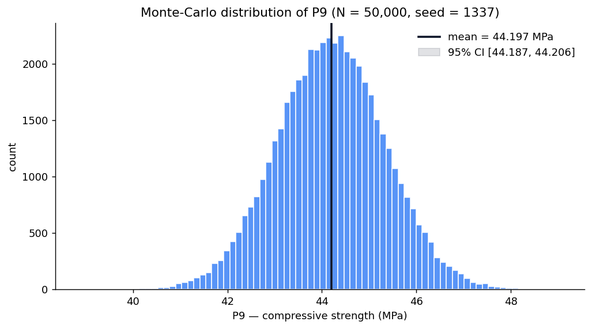
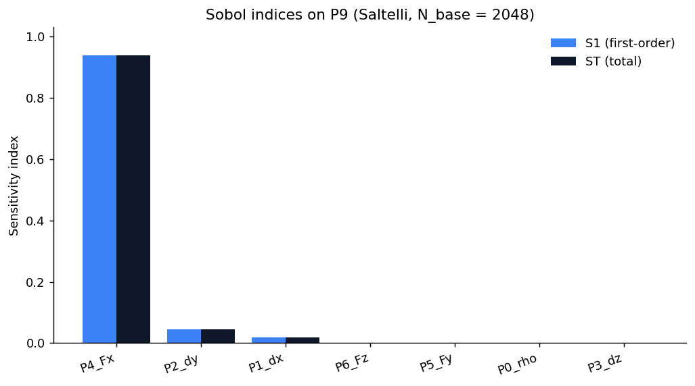
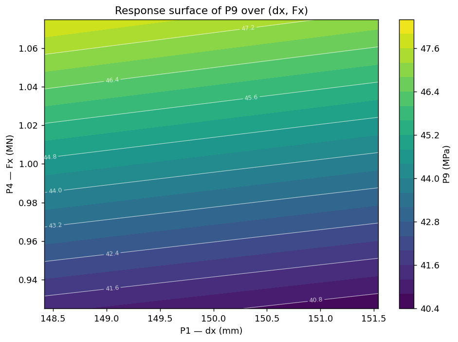
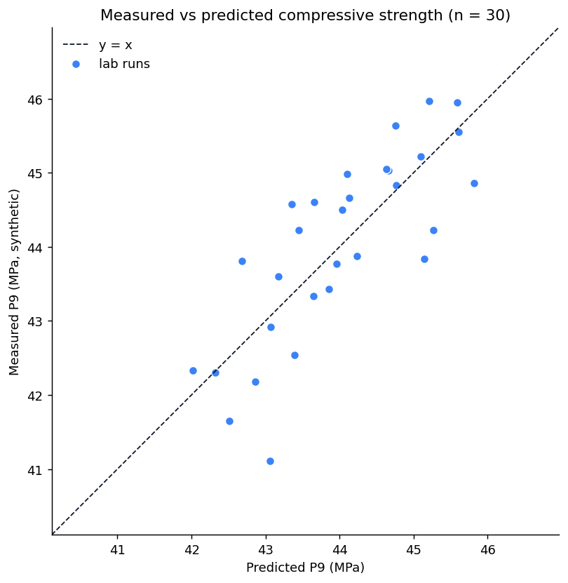

# cubespec — Python package

[](https://opensource.org/licenses/MIT)
[]()

Monte-Carlo, Design of Experiments, Response-Surface and Sobol sensitivity
for the **150 mm concrete cube compressive test** — the Python companion
to the [Sensitive-Spark dashboard](https://sensitive-spark.lovable.app).

Mirrors every numerical method implemented in the TypeScript dashboard
(`src/components/dashboard/`) so results from notebook, CLI and browser
match bit-for-bit when the same seed is used.

## Install

One-line install from GitHub (recommended for users):

```bash
pip install "git+https://github.com/ai-systems-today/cubespec.git"
```

Or, from a clone of the repo (for development):

```bash
pip install -e .
# or, with optional plotting + CLI helpers:
pip install -e ".[plot,cli,dev]"
```

(After PyPI release: `pip install cubespec`.)

## Quickstart — Python API

```python
from cubespec import (
    DEFAULT_CSP, sample_independent, compute_outputs_batch,
    bootstrap_mean_ci, sobol_indices, full_factorial, main_effects,
)

# 1. Monte-Carlo run on the default CSP
X = sample_independent(DEFAULT_CSP, n=50_000, seed=1337)
Y = compute_outputs_batch(X)             # columns: P7_def, P8_strain, P9 (MPa)
print("P9 mean:", Y[:, 2].mean())        # ≈ 44.2 MPa

# 2. 95% bootstrap CI on P9
ci = bootstrap_mean_ci(Y[:, 2], B=1000, seed=1337)
print(f"P9 95% CI = [{ci.lo:.3f}, {ci.hi:.3f}] MPa")

# 3. Full 2⁷ DOE + main effects
df = full_factorial(DEFAULT_CSP, levels=2)
print(main_effects(df).sort_values("abs", ascending=False).head())

# 4. Sobol S1 / ST sensitivity (Saltelli scheme)
print(sobol_indices(DEFAULT_CSP, n_base=1024))
```

## Quickstart — CLI

```bash
cubespec run    --csp examples/default_csp.csv --n 50000 --output report.json
cubespec doe    --csp examples/default_csp.csv --design fractional-1/4 --output design.csv
cubespec sobol  --csp examples/default_csp.csv --n 1024  --output sobol.csv
```

## Modules

| Module | Purpose | TS counterpart |
|---|---|---|
| `cubespec.model` | Surrogate σ = F/A, E ≈ k·ρ¹·⁵, ε, δ | `model.ts` |
| `cubespec.params` | CSP dataclass + CSV I/O | `types.ts` |
| `cubespec.rng` | mulberry32 (bit-for-bit) + Box–Muller | `rng.ts` |
| `cubespec.sampling` | Independent / LHS / MVN | `useMonteCarlo.ts` |
| `cubespec.doe` | Full + fractional 2^(k-p), effects (own `fracfact`) | `doe.ts` |
| `cubespec.rsm` | Quadratic OLS + 2-D contour grid | `rsm.ts` |
| `cubespec.sobol` | Saltelli A/B → S1, ST (via SALib) | `sobol.ts` |
| `cubespec.bootstrap` | Percentile bootstrap mean CI | `bootstrap.ts` |
| `cubespec.diagnostics` | RMSE, MAE, R², bias, Q-Q | `diagnostics.ts` |
| `cubespec.correlation` | Cholesky, presets, validation | `correlation.ts` |
| `cubespec.exports` | CSV / JSON writers | `exports.ts` |

## Tests

```bash
pytest python/tests/ -v
```

## Build a wheel (PyPI dry-run)

```bash
cd python
python -m build
twine check dist/*
```

To actually publish, follow the full operator runbook: **[`PUBLISHING.md`](PUBLISHING.md)**.

## Documentation

- 📖 **[CLI reference](../docs/cli.md)** — every flag, exit code, and piping example.
- 🚀 **[Publishing runbook](PUBLISHING.md)** — first release and hotfix paths.
- 📓 **[Notebooks](notebooks/)** — quickstart → DOE → RSM → Sobol → bootstrap.
- 📦 **[Examples](examples/README.md)** — CSP CSVs, correlation matrices, plot scripts.
- 📝 **[Changelog](CHANGELOG.md)**

## Example plots

Pre-rendered, committed under `examples/plots/output/`:






## License

MIT — see [LICENSE](LICENSE).
